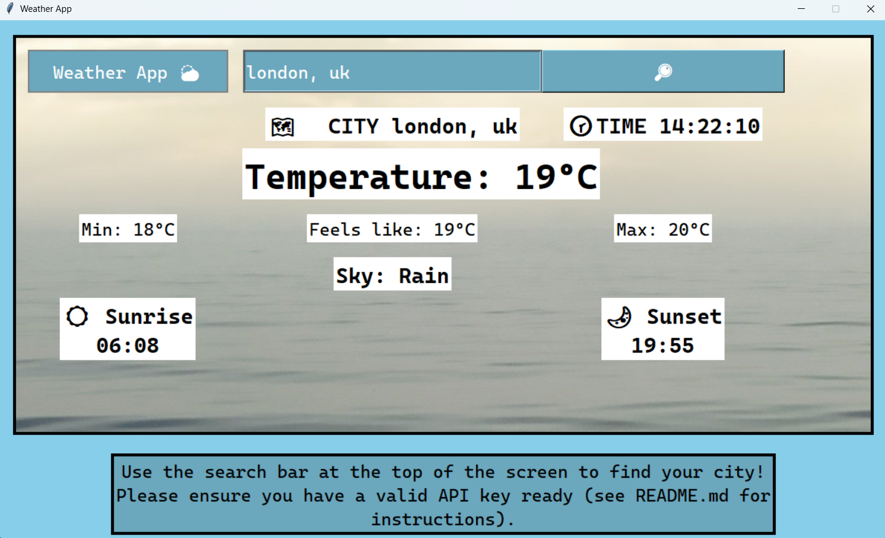

# Weather App

## Goals and About 
To code a weather app to reinforce skills in API calling, Tkinter, GUI design and Python. Will be able to search a city, make a call to OpenWeatherMap's API, and display the returned data on temperature, time, etc. in a user-friendly format. 

## Instructions
# API key
An API key is required to make a call to the server; my own is kept hidden in a gitignore file, meaning any outside users will need to request one. This is free and simple to do: go to https://openweathermap.org/api and press 'Get API key', once you've signed in and copied the key (it will be a long string of text with numbers and letters), you can hardcode it into the api_call.py file or make a file in the assets folder called API_key.txt, with (only) the key pasted into the document. Then you're ready to go!
# Usage 
Once you have an API key connected, run main.py (python main.py) and search a city in the search bar. It is possible to differentiate a search between country/same country, such as 'London,uk', 'London, england', 'London, usa', etc. Search either by pressing Enter or pressing the magifying glass. 
Displays city, time, temperature, temperature feel, min temp, max temp, sky (e.g. cloud, rain, snow), sunrise time and sunset time. Units are in local timezone and celcius. 

# Expansion 
As a student, this application is effective in developing key skills but it is worth considering steps in hypothetical large-scale deployment, that would be relevant at industry level. Here are the key points I would consider: 
1. API call limits 
This program relies on a free-tier API subscription from OpenWeatherMap and a hidden API key, requiring users to use their own. Industry products on a large scale would require a provided (encrypted) API key and are likely to exhaust the call limit on the current tier, especially if vulnerable to DDoS attacks. Therefore, a higher tier, secure API key and preventive measures against attacks would be necessary considerations. 
2. Further data 
To focus on the areas I most wanted to develop/improve, I removed the complexity of displaying multiple hours/days and opted for a user-controlled refresh system. While this could be advertised as intentionally being simple/easy for the user experience, an industry standard weather app would likely develop to include more information (again, this is also limited by a free tier so additional services may be considered, at such a level). 
3. Additional small features
A useful feature could be a manual units conversion button or automatic change to Fahrenheit if in speicific countries, etc. 
Also, the sky summary could change emojis depending on the status given (e.g. rain cloud for rains) to improve readability. 

Overall, the project works exceptionally at reinforcing the desired skills and at providing an opportunity to recognise potential development features at industry standard. 
 

